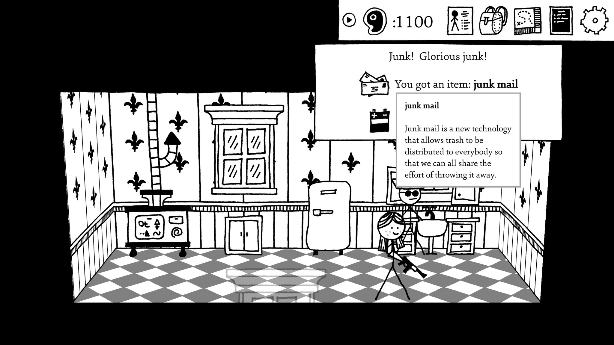
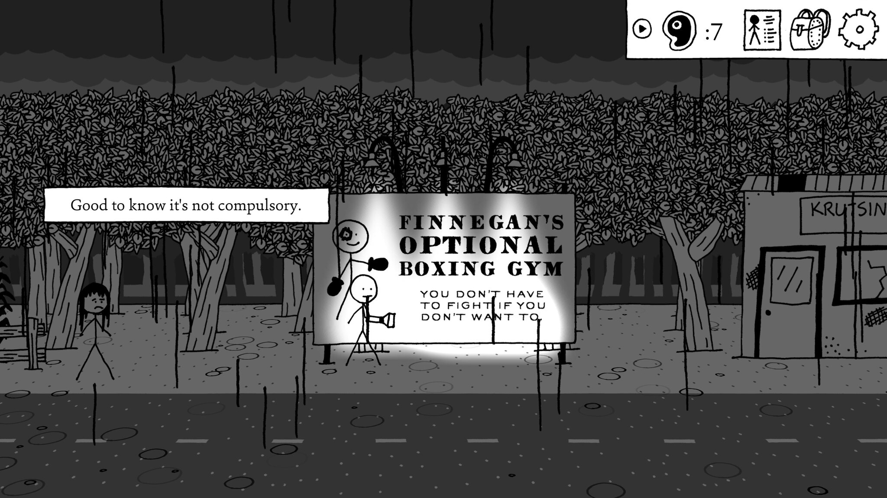

# My Yodelog

## First post ever

Hello from Yodelog!

## Shadows over Loathing
Shadows over Loathing is a text-heavy turn-based RPG about solving mysteries in a Lovecraftian setting, that is actually just a vehicle for the writers to deliver lots and lots of jokes. 

https://store.steampowered.com/app/1939160/Shadows_Over_Loathing/

---
And these are good jokes, as the writers clearly care a lot about playing with language. There are puns, visual gags, grammatical jokes, obscure dictionary humor, like 3 kinds of ye olde Englische, observational humor, all delivered in easily digestible chunks. It's the only game I know that has both an arachnophobia and arachnophilia settings in the options menu. It also plays with Lovecraftian tropes in a fun way, featuring all the usual cliches, as well as (extensive) time paradoxes and teeth nightmares.

One more thing I like with it, is that the game doesn't waste your time: there are no pointless transitions or unskippable animations (unless it's the joke), the simple animation style means that there are no loading screens, and you can increase or skip the animations in the options menu. The game lets you read it as fast as you want to. I recommend this game if you are looking for a funny Lovecraft or something with a light tone in general, just be prepared to do a lot of reading.

